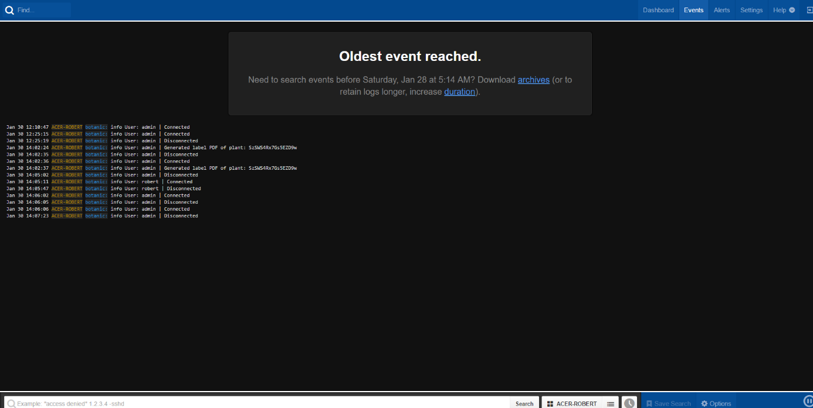

![Logo][logo-url]

# botanic

![Language][language-url] ![Meteor][meteor-url] ![License][license-url] ![Version][version-url] ![Done][done-url] ![Maintenance][maintenance-url]

### A Meteor SPA web application for botanic garden management

##### This project was developed for *Group project* classes at Electronics, Telecommunications and Informatics faculty of Gdańsk University of Technology. It was intended for [Gdańsk Medicinal Botanic Garden](http://www.orl.gumed.edu.pl/). The name group project is a little bit misleading, because this software was made only by me.

##### Have plans to improve this project in spare time.

## Main features

- Botanic is made as single-page application (SPA)
- REST API
- [Blaze](http://blazejs.org/) template engine is used
- Semantic UI as CSS library
- Main page is available in two languages: Polish and English
- All data is updating in real time (Meteor Reactivity)
- Users can order seeds from Index seminum list and check order status
- All forms are validated before submitting
- Posibility of generating reports and plants labels in PDF
- Validating inserted plant data with [GBIF API](http://www.gbif.org/developer/summary)
- User roles (permissions)
- [Papertrail](https://papertrailapp.com/) logs

## Screenshots

  
  
  
  
  
  
  
  
  
  
  
  
  
  

## Used libraries/modules

- [accounts-password](https://atmospherejs.com/meteor/accounts-password)
- [session](https://atmospherejs.com/meteor/session)
- [reactive-dict](https://atmospherejs.com/meteor/reactive-dict)
- [check](https://atmospherejs.com/meteor/check)
- [http](https://atmospherejs.com/meteor/http)
- [meteortoys:allthings](https://atmospherejs.com/meteortoys/allthings)
- [natestrauser:publish-performant-counts](https://atmospherejs.com/natestrauser/publish-performant-counts)
- [meteorhacks:ssr](https://atmospherejs.com/meteorhacks/ssr)
- [alanning:roles](https://atmospherejs.com/alanning/roles)
- [perak:joins](https://atmospherejs.com/perak/joins)
- [kadira:blaze-layout](https://atmospherejs.com/kadira/blaze-layout)
- [kadira:flow-router](https://atmospherejs.com/kadira/flow-router)
- [nimble:restivus](https://atmospherejs.com/nimble/restivus)
- [aldeed:geocoder](https://atmospherejs.com/aldeed/geocoder)
- [momentjs:moment](https://atmospherejs.com/momentjs/moment)
- [rzymek:moment-locale-pl](https://atmospherejs.com/rzymek/moment-locales)
- [fourseven:scss](https://atmospherejs.com/fourseven/scss)
- [less](https://atmospherejs.com/meteor/less)
- [semantic:ui](https://atmospherejs.com/semantic/ui)
- [natestrauser:animate-css](https://atmospherejs.com/natestrauser/animate-css)
- [dropzone.js](https://www.npmjs.com/package/dropzone)
- [clipboard.js](https://www.npmjs.com/package/clipboard)
- [phantom.js](https://www.npmjs.com/package/phantom)
- [spin.js](https://www.npmjs.com/package/spin)
- [webshot](https://www.npmjs.com/package/webshot)
- [winston](https://www.npmjs.com/package/winston)

## [Documentation](docs/)

Documentation is in form of three PDF files that cover analysing, planning and realization of this project. Unfortunately it's only available in Polish language.

- [Project analysis](docs/1_Analiza_projektowa.pdf)
- [Application project](docs/2_Projekt_systemu.pdf)
- [System introduction](docs/3_Przedstawienie_systemu.pdf)

## Installation notes

Need to install first

On Windows:
- [node.js](https://nodejs.org/en/)
- [Meteor](https://www.meteor.com/install)
- Windows Build Tools `npm install -g --production windows-build-tools`

On Linux:
- Meteor `curl https://install.meteor.com/ | sh`
- node.js `apt-get install npm`

## After cloning this repository

In the project directory type in cmd/terminal:

```
meteor npm install
```

To run application type in cmd/terminal:

```
npm start
```

[logo-url]: public/images/logo.png "Logo"
[license-url]: https://img.shields.io/badge/license-Apache%202-blue.svg?style=flat "License"
[version-url]: https://img.shields.io/badge/version-1.0.0-brightgreen.svg?style=flat "Version"
[maintenance-url]: https://img.shields.io/maintenance/no/2017.svg?style=flat "Maintenance"
[language-url]: https://img.shields.io/badge/language-JavaScript-lightgrey.svg?style=flat "Language"
[done-url]: https://img.shields.io/badge/done-01.2017-yellow.svg?style=flat "Done"
[meteor-url]: https://img.shields.io/badge/Meteor-1.4.2.3-de4f4f.svg?style=flat "Meteor"
